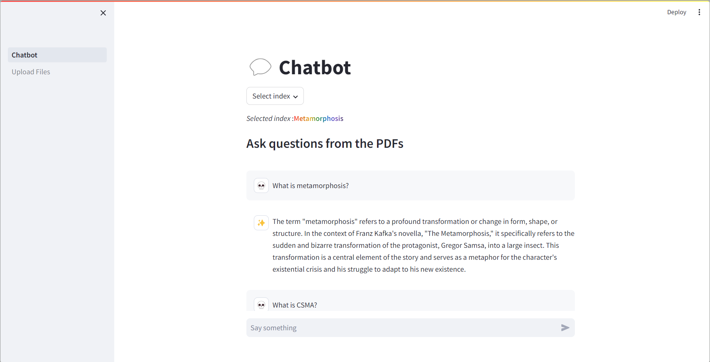

# Basic-RAG-Chatbot
 
This is a basic RAG chatbot made using LangChain, Streamlit, FAISS, Cohere's embed-english-v3.0 and OpenAI's gpt-3.5-turbo or Cohere's command-r

#
## Setup

Using ```Python 3.11.8```

1.  Clone the repo

 ```sh
 git clone https://github.com/Anindyait/RAG-Basics.git
 ```
##
2. Create and activate virtual environment
```sh
cd RAG-Basics
python -m venv .venv
.venv\Scripts\activate
```
##
 3. Install Requirements

 ```sh
pip install -r requirements.txt
```
##
4. Go to ```.venv\Lib\site-packages\langchain_community\chat_models\cohere.py```
And comment out the line ```"token_count": response.token_count,```
##

5. Create a ```.env``` file and put your Cohere API key as *COHERE_API_KEY* and OpenAI API key as *OPENAI_API_KEY*
[Cohere API Key](https://dashboard.cohere.com/api-keys)
[OpenAI API Key](https://platform.openai.com/api-keys)

```sh
OPENAI_API_KEY=[YOUR OPENAI API KEY GOES HERE]
COHERE_API_KEY=[YOUR COHERE API KEY GOES HERE]
```
*The OPENAI_API_KEY is not used by default. The chatbot uses Cohere's command-r by default.*

##
6. Run Chatbot.py
```streamlit run .\Chatbot.py```

#
---
## Use

- Navigate to ***Upload Files*** in the sidebar to upload your own PDFs (make sure the PDFs are readable)

- Store the uploaded PDFs in a new or existing index.
- Navigate to ***Chatbot*** and select the desired index.
- And ask questions to the chatbot.

